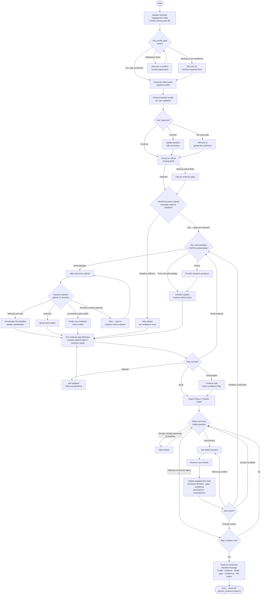
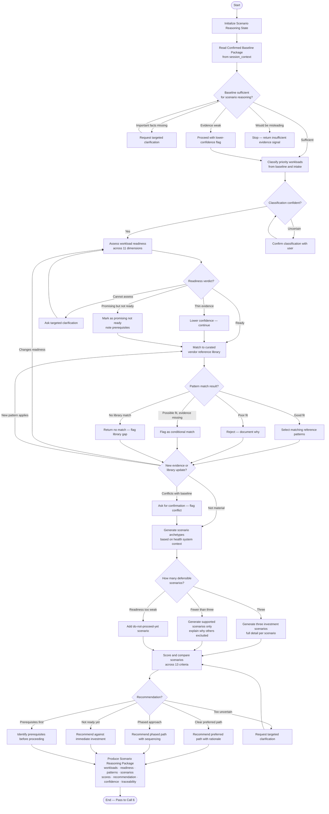
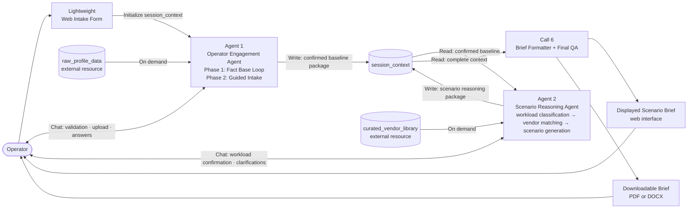

# Agent Architecture Specification

## context_domain_clustering

### llm_call_context_field_matrix

| LLM Call | health_system_name | intake_state | intake_responses | profile_summary | workload_classification | vendor_patterns | three_scenarios |
|---|:---:|:---:|:---:|:---:|:---:|:---:|:---:|
| 1. intake_question_generator | ✓ | ✓ | | | | | |
| 2. baseline_profile_evidence (revised) | ✓ | | → writes | | | | |
| 3. workload_classifier | | | ✓ | ✓ | → writes | | |
| 4. vendor_pattern_matcher | | | | | ✓ | → writes | |
| 5. scenario_generator | | | ✓ | ✓ | ✓ | ✓ | → writes |
| 6. brief_formatter + QA | ✓ | | ✓ | ✓ | ✓ | ✓ | ✓ |

### identified_clusters

**Cluster A: Fact Base Loop**
- Calls: Revised Call 2 (+ sub-calls: PHI screening, domain classification, evidence gap detection)
- Reasoning object: "What do we know about this health system — confirmed, validated, and enriched?"
- Behavior: Generates public profile → operator validates → PHI/PII acknowledgment → document upload → domain classification across 11 areas → evidence gap detection → confirmed baseline
- Key trait: Interactive loop with human validation touchpoints; state evolves as evidence is confirmed and uploaded

**Cluster B: Guided Intake**
- Calls: Call 1 (intake_question_generator)
- Reasoning object: "What strategic gaps remain after the fact base is established?"
- Behavior: Reads confirmed baseline, skips already-answered fields, asks one question at a time, adapts based on responses; can trigger targeted evidence enrichment if a meaningful gap appears
- Key trait: Loop informed by Cluster A output; does not re-ask what documents already answered

**Cluster C: Scenario Reasoning**
- Calls: Call 3 (workload_classifier), Call 4 (vendor_pattern_matcher), Call 5 (scenario_generator)
- Reasoning object: "Given this health system's full context, what AI infrastructure investment path fits?"
- Behavior: Sequential pipeline — classify workload → await operator confirmation → match vendor patterns → generate three investment scenarios with full detail
- Key trait: One explicit human touchpoint (workload classification confirmation); converts context into strategic options

### shared_context_services

**Call 6: Scenario Brief Formatter + Final QA**
- Not a reasoning cluster; terminal output service
- Reads all prior outputs; checks for missing fields, unsupported claims, conflicting facts, stale data, evidence gaps, PHI acknowledgment capture, and traceability of recommendations to fact base
- Outputs: final Scenario Brief, assumptions, confidence flags, evidence basis, recommended investment path, unresolved questions, next-step recommendations
- Design principle: *Clusters reason. Call 6 renders. Do not let the formatter become a strategist wearing a fake mustache.*

### clustering_summary
- 3 reasoning clusters (A, B, C) + 1 terminal service (Call 6)
- Clusters A and B are both interactive loops with the operator; they run sequentially (A → B)
- Cluster C is a sequential pipeline with one human confirmation gate
- Call 6 runs after all reasoning is complete; flags problems but introduces no new strategy

---

## agent_vs_service_classification

### three_question_test_results

| Cluster | Q1: Evolving state? | Q2: Branching decisions? | Q3: Stable object of concern? | Score |
|---|---|---|---|---|
| A: Fact Base Loop | YES — profile, docs, evidence, gaps build progressively | YES — gap → follow-up, doc request, or "baseline sufficient" | YES — this health system's confirmed fact base | 3/3 |
| B: Guided Intake | YES — accumulates answers, tracks resolved vs. open gaps | YES — skip answered fields, follow up, request evidence, stop | YES — unresolved strategic context after baseline | 3/3 |
| C: Scenario Reasoning | CONDITIONAL — iterative if vendor library evolves; one-pass if not | PARTIAL — one human confirmation gate, otherwise fixed sequence | YES — this health system's investment path | 2-3/3 |
| Call 6: Brief Formatter | NO | NO | NO | 0/3 |

### final_architecture_overview

**Agent-based architecture with 2 agents and 1 terminal service.**

Clusters A and B consolidated into one agent — both are operator-facing interactive loops running sequentially. Consolidation preserves clean separation (Phase 1 = fact base, Phase 2 = intake) while freeing the second agent slot for Scenario Reasoning. Cluster C preserved as Agent 2 to protect the scenario specificity quality risk.

### agents

**Agent 1: Operator Engagement Agent**
- Clusters: A (Fact Base Loop) + B (Guided Intake) — two sequential phases
- Phase 1 — Fact Base: generates public profile → operator validates → PHI/PII acknowledgment → document upload → 11-domain evidence classification → gap detection → confirmed baseline
- Phase 2 — Guided Intake: adaptive interview informed by confirmed baseline; skips already-answered fields; can trigger targeted evidence enrichment if a meaningful gap appears mid-interview
- Quality risk protected: evidence specificity — the Scenario Brief must be grounded in confirmed, organization-specific fact base, not generic assumptions
- Rationale for consolidation: both phases are operator-facing interactive loops; unified into one agent with two phases to stay within scope

**Agent 2: Scenario Reasoning Agent**
- Cluster: C (Calls 3, 4, 5)
- Workload classification → operator confirmation → vendor pattern matching → three-scenario generation
- Quality risk protected: scenario reasoning specificity — differentiated, quantitatively grounded scenarios rather than generic qualitative advice
- Aspirational capability: becomes iterative as vendor reference library grows; for MVP, one-pass with human confirmation gate

### services

**Brief Formatter + Final QA (Call 6)**
- Terminal output service; no new reasoning, no branching, no human touchpoints during execution
- Checks: missing fields, unsupported claims, conflicting facts, stale data, PHI acknowledgment capture, traceability of recommendations to fact base and intake answers
- Outputs: final Scenario Brief, assumptions, confidence flags, evidence basis, recommended path, unresolved questions, next steps
- Design principle: *Clusters reason. Call 6 renders.*

### scope_check
- Agent count: 2 (within bootcamp limit)
- Deferred: Cluster C iterative capability (vendor library updates triggering scenario refinement) → Phase 2 feature, not MVP

---

## architecture_validation

### validation_checks

| Check | Result | Notes |
|---|---|---|
| 1. Circular dependencies | ✅ Clean | Agent 1 → Agent 2 → Call 6: one-way flow, no cycles |
| 2. Context ownership | ✅ Clean | Each field has exactly one writer; Call 6 reads only |
| 3. Orphaned context | ⚠️ Resolved | Two external data resources identified and defined |
| 4. Missing handoff paths | ⚠️ Resolved | Session context object defined as unified handoff envelope |
| 5. Agent/service misclassification | ✅ Clean | All three components correctly classified |

### issues_and_resolutions

**Issue 1 — Orphaned external data sources**
- `raw_profile_data`: consumed by Agent 1 but not produced by any component
- `curated_vendor_library`: consumed by Agent 2 but not produced by any component
- Resolution: Both defined as **external data resources** (not agents or services). For MVP: `raw_profile_data` is a preloaded curated seed profile; `curated_vendor_library` is a small, versioned reference design library. Both must carry source metadata, confidence level, and last-updated fields so all recommendations are traceable. Neither is updated at runtime.

**Issue 2 — Missing agent-to-agent handoff paths**
- No defined mechanism for Agent 1 output to reach Agent 2, or Agent 2 output to reach Call 6
- Resolution: A single **session context object** travels through the entire workflow. Each component reads from it and writes its section. No component starts from scratch.

```
session_context
  ├── health_system_profile   ← external resource → validated and written by Agent 1
  ├── evidence_classification ← written by Agent 1 (Phase 1)
  ├── intake_responses        ← written by Agent 1 (Phase 2)
  ├── workload_classification ← written by Agent 2
  ├── vendor_patterns         ← written by Agent 2
  └── three_scenarios         ← written by Agent 2
```

### approved_architecture_snapshot

**Agent 1: Operator Engagement Agent**
- Phase 1 (Fact Base Loop): profile seed → operator validation → PHI acknowledgment → document upload → 11-domain classification → gap detection → confirmed baseline
- Phase 2 (Guided Intake): adaptive interview using confirmed baseline; skips already-known fields; targeted evidence enrichment on detected gap

**Agent 2: Scenario Reasoning Agent**
- Workload classification → operator confirmation gate → vendor pattern matching → three-scenario generation
- Reads from session context; adds workload_classification, vendor_patterns, three_scenarios

**Service: Brief Formatter + Final QA (Call 6)**
- Terminal service; reads complete session context; formats final Scenario Brief; flags missing fields, unsupported claims, stale data, PHI acknowledgment gaps

**External Data Resources**
- `raw_profile_data`: preloaded public seed profiles (source metadata + confidence + last-updated required)
- `curated_vendor_library`: versioned reference design library (same traceability requirements)

---

## agent_control_logic

### agent_control_loops

#### Agent 1: Operator Engagement Agent



#### Agent 2: Scenario Reasoning Agent



### agentcontext_schemas

#### Agent 2: Scenario Reasoning Agent

**Input-only fields** (from session_context and external resource)
- `confirmed_baseline_package: dict` — from Agent 1 via session_context
- `curated_vendor_library: list[dict]` — from external versioned resource
- `vendor_library_version: str`

**Agent-owned fields** (created and updated during reasoning)
- `workload_classification: list[dict]` — priority workloads with categorization
- `workload_readiness_scores: dict` — per workload, across 11 readiness dimensions
- `vendor_pattern_matches: list[dict]` — selected patterns with fit rationale
- `rejected_patterns: list[dict]` — rejected patterns with reasons
- `scenario_archetypes: list[dict]` — generated scenario options (≤3)
- `scenario_scores: dict` — comparison across 13 criteria per scenario
- `recommended_path: dict | None` — preferred path with rationale
- `assumptions: list[str]`
- `confidence_levels: dict` — per workload, per scenario
- `unresolved_gaps: list[str]`
- `evidence_basis: list[dict]` — traceability to source facts
- `scenario_reasoning_package: dict | None`

**Control/meta fields**
- `current_step: str`
- `baseline_sufficient: bool`
- `workload_confirmation_status: str` — `pending` | `confirmed` | `revised`
- `scenario_count: int`
- `insufficient_evidence: bool`
- `done: bool`
- `error: str | None`
- `iteration_count: int`
- `max_iterations: int = 20`

---

#### Agent 1: Operator Engagement Agent

**Input-only fields** (from external sources)
- `health_system_name: str`
- `raw_profile_data: dict | None` — from external preloaded public profile database
- `profile_confidence: float` — confidence score from external resource

**Agent-owned fields** (created and updated during reasoning)
- `generated_profile: dict | None`
- `user_corrections: list[dict]`
- `confirmed_baseline: dict | None`
- `uploaded_documents: list[dict]`
- `evidence_classification: dict` — keyed by 11 assessment domains
- `evidence_gaps: list[str]`
- `intake_responses: dict`
- `answered_domains: list[str]`
- `unresolved_gaps: list[str]`
- `confidence_level: float`
- `assumptions: list[str]`
- `contradictions: list[dict]`
- `source_notes: list[dict]`
- `confirmed_baseline_package: dict | None`

**Control/meta fields**
- `current_phase: str` — `phase1_fact_base` | `phase2_intake`
- `current_step: str`
- `phi_acknowledgment_status: str` — `pending` | `acknowledged` | `declined`
- `profile_validation_status: str` — `pending` | `confirmed` | `corrected` | `too_inaccurate`
- `document_upload_status: str` — `skipped` | `pending` | `complete`
- `ready_for_agent2: bool`
- `done: bool`
- `error: str | None`
- `iteration_count: int`
- `max_iterations: int = 50`

### decision_logic

**Agent 2** is agentic because it does not run a fixed template pipeline. At each decision point it reads current reasoning state and chooses from multiple possible actions — re-assess readiness, re-run vendor matching, generate fewer scenarios, stop entirely if evidence is too weak. The core question at every step: *"Given the confirmed health system context, current evidence, and available vendor reference designs, what AI infrastructure investment path is justified, feasible, safe, and defensible?"*

Design principle: *Agent 2 should act less like a template generator and more like an investment committee analyst with a decent conscience and fewer Patagonia vests.* It should not invent missing evidence to force a recommendation. A lower-confidence brief is acceptable. A falsely confident brief is not.

---

**Agent 1** is agentic because it does not execute a fixed sequence. At each step, it reads the current engagement state and chooses from multiple possible next actions. The core reasoning question at every decision point is: *"Given what we know, what is the next most useful thing to do before committing to scenario reasoning?"*

The two phases are distinct reasoning modes:
- Phase 1 reasons about *evidence quality and completeness*
- Phase 2 reasons about *strategic gaps and decision context*

Both phases write to the same session_context object and share the same stop condition: the Confirmed Baseline Package is good enough for Agent 2, not perfect.

### error_handling

- **Sensitive content detected in upload** → stop processing, request redaction and re-upload; do not propagate unreviewed content
- **PHI acknowledgment declined** → disallow upload entirely; continue with public data only; mark upload_status = skipped
- **Profile too inaccurate** → fall back to guided fact collection; do not abandon session
- **Gaps unresolvable** → continue with lower confidence flag; document as limitation in Confirmed Baseline Package
- **Max iterations reached** → stop intake, produce package with current state, flag incomplete domains
- **External resource unavailable** (raw_profile_data not found) → ask user for minimum required facts; do not fail silently

---

## service_composition

### service_orchestration_patterns

**Top-level pattern: Sequential Pipeline**
Agent 1 → Agent 2 → Call 6. Each component consumes the session_context built by prior components and adds its section before passing it forward. No component starts from scratch.

**Internal pattern: Agent-Driven**
Within Agent 1 and Agent 2, the agent decides which tools/services to call and when — based on current state, not a fixed sequence. External resources (raw_profile_data, curated_vendor_library) are called on demand by the agents, not pre-loaded into the pipeline.

**Entry pattern: Lightweight form → guided chat**
The session is initialized by a lightweight web intake form (health system name, user role, primary AI priorities, optional constraints, optional upload intent). After initialization, Agent 1 takes over as a guided chat experience. The form sets up the session_context; the chat runs the agent logic.

### component_integration

| From | To | What passes | When |
|---|---|---|---|
| User | Web intake form | health_system_name, user_role, primary_priorities, constraints, upload_intent | Session start |
| Web intake form | Agent 1 | Initialized session_context (partial) | Once, at session start |
| External resource | Agent 1 | raw_profile_data, profile_confidence | On demand — Step 1 of Phase 1 |
| User (chat) | Agent 1 | Profile corrections, PHI acknowledgment, uploaded docs, intake answers | Iteratively throughout Phase 1 + 2 |
| Agent 1 | session_context | Confirmed baseline package (profile, evidence_classification, intake_responses, gaps, confidence, PHI status) | On completion of Phase 2 |
| session_context | Agent 2 | Confirmed baseline package | Agent 2 start |
| External resource | Agent 2 | curated_vendor_library (versioned) | On demand — Step 3 |
| User (chat) | Agent 2 | Workload classification confirmation, targeted clarifications | At human gate points |
| Agent 2 | session_context | Scenario reasoning package (workloads, readiness, patterns, scenarios, scores, recommendation, confidence, traceability) | On completion |
| session_context | Call 6 | Complete session_context | After Agent 2 completes |
| Call 6 | User | Displayed Scenario Brief (web) + downloadable PDF/DOCX | Final output |

### data_flow_mapping



### architecture_overview

**Complete system composition:**
- 2 agents (Agent 1: Operator Engagement, Agent 2: Scenario Reasoning)
- 1 terminal service (Call 6: Brief Formatter + Final QA)
- 2 external data resources (raw_profile_data, curated_vendor_library)
- 1 shared session_context object (the data envelope that travels through the system)
- 1 chat UI (entry point + operator interaction throughout)
- 2 output formats (web display + downloadable PDF/DOCX)

**Primary orchestration:** Sequential pipeline at system level; agent-driven internally

**Critical integration points:**
1. Web intake form → Agent 1: session_context initialization
2. Agent 1 → session_context: Confirmed Baseline Package handoff
3. session_context → Agent 2: scenario reasoning input
4. Agent 2 → session_context: Scenario Reasoning Package handoff
5. session_context → Call 6: complete context for formatting and QA

**Isolation boundary:** Agent 1 and Agent 2 communicate only through session_context. Neither agent calls the other directly. This means Agent 1 can be tested independently of Agent 2, and Call 6 can be tested against any valid session_context regardless of how it was produced.

---

## implementation_update

**What we're building:** A single conversational AI agent (Level 2 — AI as Collaborator) that guides a health system senior IC through structured intake and produces one artifact: the AI Infrastructure Investment Scenario Brief.

**Platform:** n8n (no-code, visual workflow)

**Implementation state:** Design complete via ideation workflow. No code written. 6 days remain before the June 19 demo.

**Interaction pattern:** Conversation → structured field capture → workload classification confirmation → scenario generation → operator review → final brief

**Quality risk — evolved understanding:**
- Original risk: Will the AI generate three *meaningfully differentiated* scenarios (not generic advice)?
- New signal from experiment #1: The Scenario Brief output felt more **qualitative than quantitative** — narratives without enough numbers (budget ranges, infrastructure sizing, governance maturity scores)
- This means the quantitative gap is now the sharpest quality risk to design around

**Experiment status:**
- Test 1 complete (mid-size regional health system scenario) — revealed the qualitative/quantitative gap
- Test 2 (large academic medical center with aggressive ambition + fragmented governance) — not yet run
- Both tests needed before architecture locks in, particularly to validate the classification logic under a harder edge case
